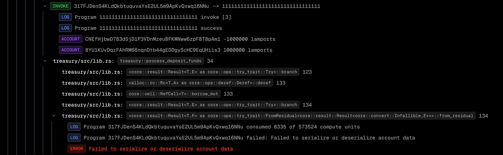
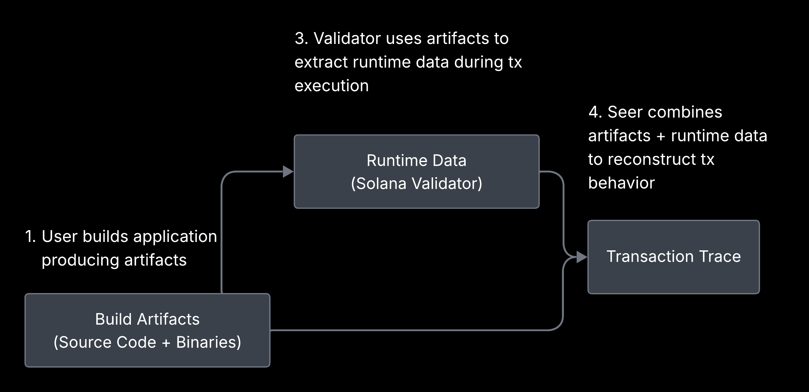

# Seer in a Nutshell

Seer facilitates development of Solana programs by enabling transaction debugging.

This document demonstrates how it works and shares implementation details.

## Seer is a Drop-in Replacement

Before releasing, developers test their programs using solana-test-validator in their integration and e2e tests.

When an error occurs, debugging is limited to logs that must be declared in code beforehand, creating a loop: log → test → log.

Seer brings essential developer tooling to Solana: a debugger. When you run into an error, you don't need to rely on logs to find the cause - you can see the full call stack.

Your code doesn't need to be changed. Seer is a drop-in replacement for solana-test-validator.

## How It Works in Practice

1. When you're ready to test your application, run the CLI command:
    ```bash
    seer run
    ```
2. Your application files (`.rs` and `.so`) are loaded to Seer Backend to add execution context to the Solana Validator instance.
3. You're ready to run your tests, e.g.:
   ```bash
   cargo test
   ```
4. You can see your transactions with their call stacks in the Seer Dashboard in your browser.
5. Want to test a new version of your code? Return to step 1.

Example of transaction trace:


## Under the Hood

Seer builds a debug context using your application files (`.rs` Rust sources and `.so` compiled Solana programs) and starts a new Solana Validator instance with it. When the Solana Validator receives a new transaction, it uses the debug context to extract all significant steps and build the call stack.


